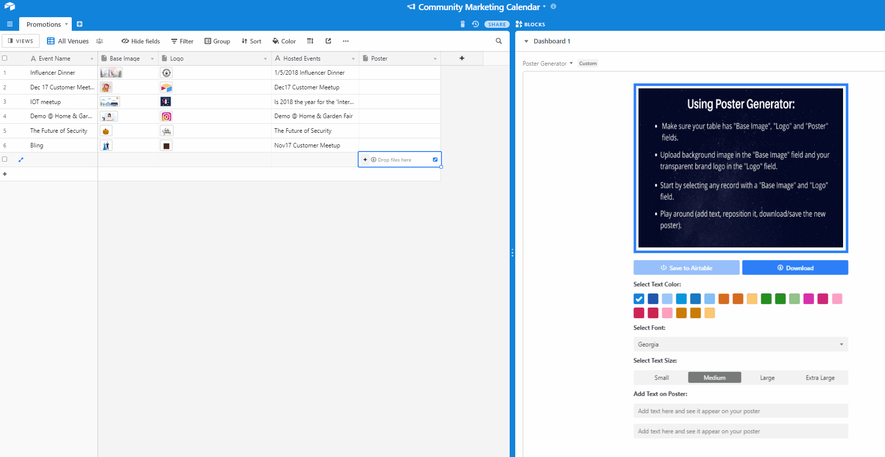

# Poster Generator Block (Airtable Custom block)

Create social media banners and graphic images for any platform in minutes without leaving airtable with Poster Generator. Best suited for **rapid design prototyping** and bringing brand campaigns ideas to life.

<div align="center">
  &nbsp;&nbsp;
</div>

## Inspiration and perspective behind building the Poster Generator cusotom block

Advertising, both print and digital account for 54.39 billion dollars of market when clubbed together [Goldstein Report](<https://www.goldsteinresearch.com/report/india-advertising-market#:~:text=Goldstein%20Research%20analyst%20forecast%20that,period%20(2017%2D2025).>). According to this [report](https://themanifest.com/advertising/small-business-advertising-spending-2019) from the manifest, nearly all small businesses (91%) plan to increase their advertising spending, indicating that small businesses prioritize advertising and see it as a beneficial marketing strategy.

I lead a developer community and although I am not a marketeer, after some discussion with friends in the space I found out that when it came to building assets(posters to be more specific) marketing managers and event managers have exactly the same needs:

1. A **RAPID** poster building/prototyping tool that is really easy to edit.
2. Shouldn't require design experience.
3. Poster should showcase my/client's brand well without much editing effort.
4. Something strictly within Airtable to avoid platform switches and all the friction that comes along.
5. Customizable/draggable text.
6. Downloadable outside airtable as well.

I realized this is a great market fit and it uncovered a need for a small to medium business (for quick execution and generating posters for campaigning) and also for a large organization with a dedicated design team (for rapid prototyping inside airtable) and started on towards my journey of building the **poster generator custom block** over an airtable base in my workspace.

Please note that blocks are still in beta and are accessibe in Pro and Enterprise workspaces for now.

To support planning and managing of these advertising campaigns, airtable already has a base template which can be accessed [here](https://airtable.com/templates/marketing/expNoL0sYUbOogSCm/advertising-campaigns) which I think is the best suited place to install and experience the block.

## Pre-requisites:

The poster generator custom block has just the following pre-requisites:

<div align="center">
    
</div>

## Features:

1. Onboarding of new users

2. Image and brand logo insertion

3. Canvas updation on record selection

4. Customization Options:

   - Font Color
   - Font Size
   - Font

5. Text Insertion and Repositioning (Drag and Drop)

6. Download Option

7. Save to Airtable

## Polished to an extent:

- The block watches for changes using useBase

- Queries where possible are hadled with 'ifExists' e.g. 'getTableIfExist' and fallback conditions are handled accordingly

- Fallback triggered if the record doesn't have a "Base Image" or a "Logo" field to allow selecting any record once table has the necessary fields.

- Limited record data is loaded by using query params:

  ```js
      const selectedRecord = useRecordById(
      table,
      selectedRecordId ? selectedRecordId : "",
      {
      fields: ["Base Image", "Logo", "Event Name", "Poster"],
      }
  ```

```

- Base Image is auto scaled to fit canvas size

- Rectangle logo and a square logo are auto scaled down to give a branding presence on the top right corner

- Mouse out and Mouse up events remove selected text during drag and drop text operations.

* Image cross origin is set to Anonymous to prevent the canvas from getting tainted, so we can be assured the image saved will be exactly the same as on canvas

## Work Areas:

## Challenges and Accomplishments:

## Contributions

Please feel free to contribute to the quality of code by submitting PRs for improvements to code and documentation etc.

Any contributions you make to this effort **are of course greatly appreciated**.

## License & Copyright

<a rel="license" href="https://opensource.org/licenses/MIT"></a><br />This work is licensed under a <a rel="license" href="https://opensource.org/licenses/MIT">MIT License</a>.
```
